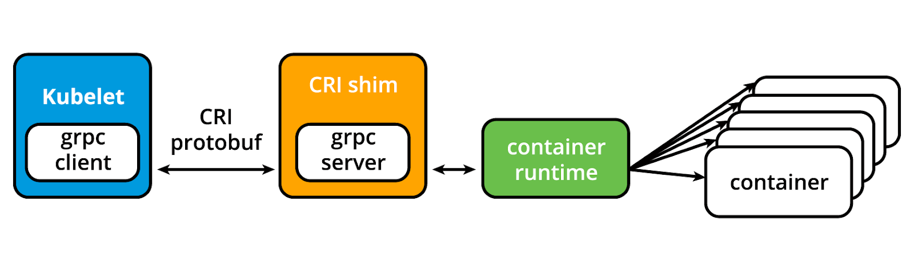
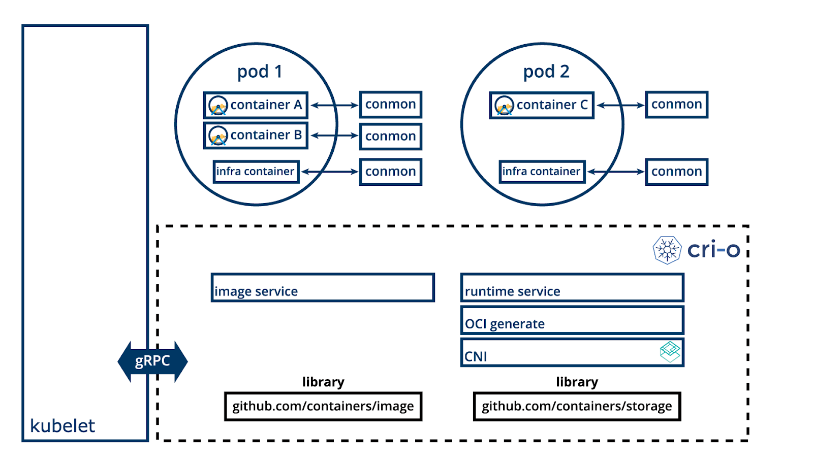
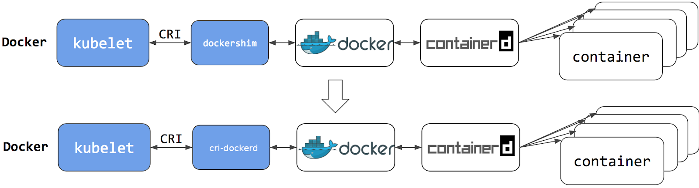

# LSF 158 Introduction to Kubernetes

- [02. From Monolith the Microservices](#02-from-monolith-the-microservices)
  - [The Legacy Monolith](#the-legacy-monolith)
  - [The Modern Microservice](#the-modern-microservice)
  - [Refactoring](#refactoring)
  - [other considerations](#other-considerations)
  - [Challenges](#challenges)
- [03. Container Orchestration](#03-container-orchestration)
  - [What are containers](#what-are-containers)
  - [What is Container Orchestration](#what-is-container-orchestration)
  - [Why Use Container Orchestrators](#why-use-container-orchestrators)
  - [Where to deploy container orchestrators](#where-to-deploy-container-orchestrators)
- [04. Kubernetes](#04-kubernetes)
  - [What is Kubernetes](#what-is-kubernetes)
  - [Kubernetes Features](#kubernetes-features)
  - [Why User Kebernetes](#why-user-kebernetes)
  - [Cloud Native Computing Foudation (CNCF)](#cloud-native-computing-foudation-cncf)
- [05. Kubernetes Architecture](#05-kubernetes-architecture)
  - [Control Plane Node Overview](#control-plane-node-overview)
  - [Control Plane Node Components](#control-plane-node-components)
  - [Worker Node Overview](#worker-node-overview)
  - [Worker Node Components](#worker-node-components)
  - [Networking Challenges](#networking-challenges)
- [06. Installing Kubernetes](#06-installing-kubernetes)
  - [Kubernetes Configuration](#kubernetes-configuration)
  - [Infrastructure for Kubernetes Installation](#infrastructure-for-kubernetes-installation)
  - [Installing Local Learning Clusters](#installing-local-learning-clusters)
  - [Installing Production Clusters with Deployment Tools](#installing-production-clusters-with-deployment-tools)
  - [Production Clusters from Certified Solutions Providers](#production-clusters-from-certified-solutions-providers)
  - [Kubernetes on Windows](#kubernetes-on-windows)
- [07. Minikube: Installing Local Kubernetes Clusters](#07-minikube-installing-local-kubernetes-clusters)
  - [What is MiniKube](#what-is-minikube)
  - [Requirements for Running Minikube](#requirements-for-running-minikube)
  - [Installing Minikube on Linux](#installing-minikube-on-linux)
  - [Installing Minikube on macOS](#installing-minikube-on-macos)
  - [Installing Minikube on Windows](#installing-minikube-on-windows)
  - [Advanced Minikube Features](#advanced-minikube-features)
  - [Demo Video: Getting Started with Minikube and Profiles](#demo-video-getting-started-with-minikube-and-profiles)
- [08. Accessing Minikube](#08-accessing-minikube)
  - [Accessing Minikube](#accessing-minikube)
  - [More kubectl](#more-kubectl)
  - [Installing kubetcl on Linux](#installing-kubetcl-on-linux)
  - [Installing kubetcl on macOS](#installing-kubetcl-on-macos)
  - [Installing kubetcl on Windows](#installing-kubetcl-on-windows)
  - [kubectl Configuration File](#kubectl-configuration-file)
  - [Kubernetes Dashboard](#kubernetes-dashboard)
  - [APIs with 'kubectl proxy'](#apis-with-kubectl-proxy)
- [09. Kubernetes Building Blocks](#09-kubernetes-building-blocks)
  - [Kubernetes Object Model](#kubernetes-object-model)
  - [Nodes](#nodes)
  - [Namespaces](#namespaces)
  - [Pods](#pods)
  - [Labels](#labels)
  - [Label Selectors](#label-selectors)
  - [ReplicationControllers](#replicationcontrollers)
  - [ReplicaSets](#replicasets)
  - [Deployments](#deployments)
  - [DaemonSets](#daemonsets)
  - [Services](#services)
- [10. Authentication, Authroization, Admission Control](#10-authentication-authroization-admission-control)
- [11. Services](#11-services)
- [12. Deploying a Standalone Application](#12-deploying-a-standalone-application)
- [13. Kubernetes Volume Management](#13-kubernetes-volume-management)
- [14. ConfigMaps](#14-configmaps)
- [15. Ingress](#15-ingress)
- [16. Advanced Topics](#16-advanced-topics)
- [17. Kubetnetes Community](#17-kubetnetes-community)

## 02. From Monolith the Microservices

### The Legacy Monolith

#### the monolith application

sedimented layers of features and redundant logic translated into thousands of lines of code, written in a single, not so modern programming language, based on outdated software architecture patterns and principles.  

#### new features and improvements

add to code complexity  
loading, compiling, and building times increase with every new update  
some ease in administration as the application is running on a single server, ideally a Virtual Machine or a Mainframe.  

#### expensive taste in hardware

a large, single piece of software which continuously grows  
has to run on a single system which has to satisfy its compute, memory, storage, and networking requirements  
complex, pricy, challenging to procure.  

#### scaling

almost impossible  
hardcoded number of connections and operations  
achieved by manually deploying a new instance on another server, typically behind a load balancing appliance - another pricey solution.  

#### upgrading, patching, migrating

downtime is inevitable  
maintenance windows planned well in advance as disruptions in service are expected to impact clients  
third party solutions to minimize downtime to customers by setting up monolith applications in a highly available active/passive configuration  
third party solutions introduce new challenges for system engineers to keep all systems at the same patch level and may introduce new possible licensing costs.  

### The Modern Microservice

#### deployed individually

separate servers provisioned with fewer resources  
 only what is required by each service and the host system itself  
lowers compute resource expenses.  

#### Architecture

aligned with Event-driven Architecture and Service-Oriented Architecture (SOA) principles  
complex applications are composed of small independent processes which communicate with each other through Application Programming Interfaces (APIs) over a network  
APIs allow access by other internal services of the same application or external, third-party services and applications.  

#### Development

developed and written in a modern programming language  
languages is selected as best suitable for the type of service and its business function  
flexibility when matching microservices with specific hardware when required, allowing deployments on inexpensive commodity hardware.  

#### Scalability

each microservice can be scaled individually, either manually or automated through demand-based autoscaling.  

#### Upgrades and Patching

virtually no downtime or service disruption to clients  
upgrades are rolled out seamlessly - one service at a time, rather than having to recompile, rebuild and restart an entire monolithic application  
businesses are able to develop and roll out new features and updates a lot faster, in an agile approach, having separate teams focusing on separate features, thus being more productive and cost-effective.  

### Refactoring  

migrating a decades-old application to the cloud through refactoring poses serious challenges and the enterprise faces the refactoring approach dilemma: a "Big-bang" approach or an incremental refactoring.

#### "Big-bang" approach

postponing the development and implementation of any new features
breaking the core of the business, the monolith.

#### Incremental refactoring approach

new features are developed and implemented as modern microservices  
able to communicate with the monolith through APIs, without appending to the monolith's code  
features are refactored out of the monolith which slowly fades away  
offers a gradual transition from a legacy monolith to modern microservices architecture  
allows for phased migration of application features into the cloud.  

### other considerations

Which business components become distributed microservices  
how to decouple the databases from the application to separate data complexity from application logic  
how to test the new microservices and their dependencies

The refactoring phase slowly transforms the monolith into a cloud-native application which takes full advantage of cloud features, by coding in new programming languages and applying modern architectural patterns. Through refactoring, a legacy monolith application receives a second chance at life - to live on as a modular system adapted to fully integrate with today's fast-paced cloud automation tools and services.

### Challenges

Not all monoliths are perfect candidates for refactoring  
some may not even "survive" such a modernization phase

#### issues to consider

- legacy Mainframe based system, written in older programming languages - Cobol or Assembler, it may be more economical to just re-build it from the ground up as a cloud native application
- A poorly designed legacy application should be re-designed and re-built from scratch following modern architectural patterns for microservices and even containers  
- Applications tightly coupled with data stores are also poor candidates for refactoring.
- design mechanisms and/or tools to keep alive all the decoupled modules to ensure application resiliency as a whole.

***Choosing runtimes***  
If deploying many modules on a single physical or virtual server, chances are that different libraries and runtime environments may conflict with one another, causing errors and failures  
This forces deployments of single modules per servers in order to separate their dependencies - not an economical way of resource management, and no real segregation of libraries and runtimes, as each server also has an underlying Operating System running with its libraries, thus consuming server resources - at times the OS consuming more resources than the application module itself.  

Application containers came along providing encapsulated lightweight runtime environments for application modules. Containers promised consistent software environments for developers, testers, all the way from Development to Production  
Wide support of containers ensured application portability from physical bare-metal to Virtual Machines, but this time with multiple applications deployed on the very same server, each running in their own execution environments isolated from one another, thus avoiding conflicts, errors, and failures  
Other features of containerized application environments are higher server utilization, individual module scalability, flexibility, interoperability and easy integration with automation tools.

## 03. Container Orchestration

### What are containers

application-centric method to deliver high-performing, scalable applications on any infrastructure
deliver microservices by providing portable, isolated virtual environments for applications to run without interference from other running applications

  

***Microservices***
lightweight applications written in various modern programming languages, with specific dependencies, libraries and environmental requirements  
ensure that an application has everything it needs to run successfully it is packaged together with its dependencies  

Containers encapsulate microservices and their dependencies but do not run them directly  
Containers run container images  

A container image bundles the application along with its runtime, libraries, and dependencies  
represents the source of a container deployed to offer an isolated executable environment for the application  
Containers can be deployed from a specific image on many platforms, such as workstations, Virtual Machines, public cloud, etc  

### What is Container Orchestration

***In Development (Dev) environments:*** running containers on a single host for development and testing of applications is suitable option  
***Quality Assurance (QA) and Production (Prod):*** no longer a viable to to run on a single host because the applications and services need to meet specific requirements:

- Fault-tolerance
- On-demand scalability
- Optimal resource usage
- Auto-discovery to automatically discover and communicate with each other
- Accessibility from the outside world
- Seamless updates/rollbacks without any downtime.

#### Container orchestrators

tools which group systems together to form clusters where containers' deployment and management is automated at scale while meeting the requirements
clustered systems confer the advantages of distributed systems, such as increased performance, cost efficiency, reliability, workload distribution, and reduced latency

With enterprises containerizing their applications and moving them to the cloud, there is a growing demand for container orchestration solutions. While there are many solutions available, some are mere re-distributions of well-established container orchestration tools, enriched with features and, sometimes, with certain limitations in flexibility.  

Although not exhaustive, the list below provides a few different container orchestration tools and services available today:  

***Amazon Elastic Container Service (ECS)*** is a hosted service provided by Amazon Web Services (AWS) to run containers at scale on its infrastructure.
***Azure Container Instance (ACI)*** is a basic container orchestration service provided by Microsoft Azure.
***Azure Service Fabric*** is an open source container orchestrator provided by Microsoft Azure.
***Kubernetes*** is an open source orchestration tool, originally started by Google, today part of the Cloud Native Computing Foundation (CNCF) project.
***Nomad*** is the container and workload orchestrator provided by HashiCorp.
***Docker Swarm*** is a container orchestrator provided by Docker, Inc. It is part of Docker Engine.

### Why Use Container Orchestrators

orchestrators make things much easier for users especially when it comes to managing hundreds or thousands of containers running on a global infrastructure.

- Group hosts together while creating a cluster, in order to leverage the benefits of distributed systems
- Schedule containers to run on hosts in the cluster based on resources availability.
- Enable containers in a cluster to communicate with each other regardless of the host they are deployed to in the cluster.
- Bind containers and storage resources.
- Group sets of similar containers and bind them to load-balancing constructs to simplify access to containerized applications by creating an interface, a level of abstraction between the containers and the client.
- Manage and optimize resource usage.
- Allow for implementation of policies to secure access to applications running inside containers.

container orchestrators are an obvious choice when it comes to managing containerized applications at scale  

### Where to deploy container orchestrators

#### deployed on the infrastructure of our choice

bare metal, Virtual Machines, on-premises, on public and hybrid clouds  

***Kubernetes***  
can be deployed on a workstation
deployed with or without an isolation layer such as a local hypervisor or container runtime
inside a company's data center, in the cloud on AWS Elastic Compute Cloud (EC2) instances, Google Compute Engine (GCE) VMs, DigitalOcean Droplets, IBM Virtual Servers, OpenStack, etc.  

***turnkey cloud solutions***  
allow production Kubernetes clusters to be installed, with only a few commands, on top of cloud Infrastructures-as-a-Service  
paves the way for the managed container orchestration as-a-Service (Kubernetes as-a-Service (KaaS)) solution, offered and hosted by the major cloud providers
Examples of KaaS solutions: Amazon Elastic Kubernetes Service (Amazon EKS), Azure Kubernetes Service (AKS), DigitalOcean Kubernetes, Google Kubernetes Engine (GKE), IBM Cloud Kubernetes Service, Oracle Container Engine for Kubernetes, or VMware Tanzu Kubernetes Grid.

## 04. Kubernetes  

### What is Kubernetes  

"[Kubernetes](https://kubernetes.io/) is an open-source system for automating deployment, scaling, and management of containerized applications".

Kubernetes comes from the Greek word κυβερνήτης, which means helmsman or ship pilot  
we can think of Kubernetes as the pilot on a ship of containers

referred to as k8s (pronounced Kate's), as there are 8 characters between k and s  

highly inspired by the Google Borg system, a container and workload orchestrator for its global operations  
Google has been using for more than a decade. It is an open source project written in the Go language and licensed under the License, Version 2.0.  

New Kubernetes versions are released in 4 month cycles. The current stable version is 1.29 (as of December 2023).  

### Kubernetes Features

#### fully supported features

  ***Automatic bin packing:*** Kubernetes automatically schedules containers based on resource needs and constraints, to maximize utilization without sacrificing availability.
  ***Designed for extensibility:*** A Kubernetes cluster can be extended with new custom features without modifying the upstream source code.
  ***Self-healing:*** Kubernetes automatically replaces and reschedules containers from failed nodes. It terminates and then restarts containers that become unresponsive to health checks, based on existing rules/policy. It also prevents traffic from being routed to unresponsive containers.
  ***Horizontal scaling:*** Kubernetes scales applications manually or automatically based on CPU or custom metrics utilization.
  ***Service discovery and load balancing:*** Containers receive IP addresses from Kubernetes, while it assigns a single Domain Name System (DNS) name to a set of containers to aid in load-balancing requests across the containers of the set.
  ***Automated rollouts and rollbacks:*** Kubernetes seamlessly rolls out and rolls back application updates and configuration changes, constantly monitoring the application's health to prevent any downtime.
  ***Secret and configuration management:*** Kubernetes manages sensitive data and configuration details for an application separately from the container image, in order to avoid a rebuild of the respective image. Secrets consist of sensitive/confidential information passed to the application without revealing the sensitive content to the stack configuration, like on GitHub.
  ***Storage orchestration:*** Kubernetes automatically mounts software-defined storage (SDS) solutions to containers from local storage, external cloud providers, distributed storage, or network storage systems.
  ***Batch execution:*** Kubernetes supports batch execution, long-running jobs, and replaces failed containers.
  ***IPv4/IPv6 dual-stack:*** Kubernetes supports both IPv4 and IPv6 addresses.

#### Platform as a Service features

  application deployment
  scaling
  load balancing
  allows users to integrate their desired monitoring, logging and alerting solutions through optional plugins.

### Why User Kebernetes

***Portability:*** can be deployed in many environments such as local or remote Virtual Machines, bare metal, or in public/private/hybrid/multi-cloud setups.

***Extensibility:*** support and to be supported by many 3rd party open source tools which enhance Kubernetes' capabilities and provide a feature-rich experience to its users

***Architecture:*** modular and pluggable. Not only does it orchestrate modular, decoupled microservices type applications, but also its architecture follows decoupled microservices patterns. Kubernetes' functionality can be extended by writing custom resources, operators, custom APIs, scheduling rules or plugins.

### Cloud Native Computing Foudation (CNCF)

one of the largest sub-projects hosted by the Linux Foundation  
aims to accelerate the adoption of containers, microservices, and cloud native applications
Provides a neutral home for the Kubernetes trademark and enforces proper usage.  
Provides license scanning of core and vendor code.  
Offers legal guidance on patent and copyright issues.  
Creates and maintains open source learning curriculum, training, and certification for Kubernetes and cloud native associates (KCNA), Kubernetes administrators (CKA), Kubernetes application developers (CKAD), Kubernetes security specialists (CKS), and more.  
Manages a software conformance working group.  
Actively markets Kubernetes.  
Supports ad hoc activities.  
Sponsors conferences and meetup events.  

***Popular graduated projects (as of March 2024):***  

    Kubernetes container orchestrator
    Argo workflow engine for Kubernetes
    etcd distributed key-value store
    CoreDNS DNS server
    containerd container runtime
    CRI-O container runtime
    Envoy cloud native proxy
    Fluentd for unified logging
    Flux continuous delivery for Kubernetes
    Harbor registry
    Helm package management for Kubernetes
    Linkerd service mesh for Kubernetes
    Open Policy Agent policy engine
    Prometheus monitoring system and time series DB
    Rook cloud native storage orchestrator for Kubernetes

## 05. Kubernetes Architecture  

At a very high level, Kubernetes is a cluster of compute systems categorized by their distinct roles:

    - One or more control plane nodes
    - One or more worker nodes (optional, but recommended). 

  

### Control Plane Node Overview

provides a running environment for the control plane agents responsible for managing the state of a Kubernetes cluster, and it is the brain behind all operations inside the cluster  
control plane components are agents with very distinct roles in the cluster's management  
In order to communicate with the Kubernetes cluster, users send requests to the control plane via a Command Line Interface (CLI) tool, a Web User-Interface (Web UI) Dashboard, or an Application Programming Interface (API).  

It is important to keep the control plane running at all costs  
Losing the control plane may introduce downtime, causing service disruption to clients, with possible loss of business  
To ensure the control plane's fault tolerance, control plane node replicas can be added to the cluster, configured in High-Availability (HA) mode  
While only one of the control plane nodes is dedicated to actively managing the cluster, the control plane components stay in sync across the control plane node replicas
This type of configuration adds resiliency to the cluster's control plane, should the active control plane node fail.

To persist the Kubernetes cluster's state, all cluster configuration data is saved to a distributed key-value store which only holds cluster state related data, no client workload generated data  
The key-value store may be configured on the control plane node (stacked topology), or on its dedicated host (external topology) to help reduce the chances of data store loss by decoupling it from the other control plane agents  

***stacked key-value store topology:*** HA control plane node replicas ensure the key-value store's resiliency as well
***external key-value store topology:*** dedicated key-value store hosts have to be separately replicated for HA, a configuration that introduces the need for additional hardware, hence additional operational costs.

### Control Plane Node Components

#### API Server

All administrative tasks are coordinated by the kube-apiserver  
central control plane component running on the control plane node  
intercepts RESTful calls from users, administrators, developers, operators and external agents, then validates and processes them  
During processing, reads Kubernetes cluster's current state from the key-value store  
after a call's execution, the resulting state of the Kubernetes cluster is saved in the key-value store for persistence  
is the only control plane component to talk to the key-value store, both to read from and to save Kubernetes cluster state information - acting as a middle interface for any other control plane agent inquiring about the cluster's state  

highly configurable and customizable
can scale horizontally, but it also supports the addition of custom secondary API Servers, a configuration that transforms the primary API Server into a proxy to all secondary, custom API Servers, routing all incoming RESTful calls to them based on custom defined rules.

#### Scheduler

The role of the kube-scheduler: assign new workload objects to nodes
During the scheduling process, decisions are made based on current Kubernetes cluster state and new workload object's requirements
The scheduler obtains from the key-value store, via the API Server, resource usage data for each worker node in the cluster  
The scheduler also receives from the API Server the new workload object's requirements which are part of its configuration data  
Requirements may include constraints that users and operators set, such as scheduling work on a node labeled with disk==ssd key-value pair
The scheduler also takes into account Quality of Service (QoS) requirements, data locality, affinity, anti-affinity, taints, toleration, cluster topology, etc  
Once all the cluster data is available, the scheduling algorithm filters the nodes with predicates to isolate the possible node candidates which then are scored with priorities in order to select the one node that satisfies all the requirements for hosting the new workload. The outcome of the decision process is communicated back to the API Server, which then delegates the workload deployment with other control plane agents.

The scheduler is highly configurable and customizable through scheduling policies, plugins, and profiles. Additional custom schedulers are also supported, then the object's configuration data should include the name of the custom scheduler expected to make the scheduling decision for that particular object; if no such data is included, the default scheduler is selected instead.

A scheduler is extremely important and complex in a multi-node Kubernetes cluster, while in a single-node Kubernetes cluster possibly used for learning and development purposes, the scheduler's job is quite simple.

#### Controller Managers

runs controllers or operator processes to regulate the state of the Kubernetes cluster  
are watch-loop processes continuously running and comparing the cluster's desired state (provided by objects' configuration data) with its current state (obtained from the key-value store via the API Server)  
In case of a mismatch, corrective action is taken in the cluster until its current state matches the desired state.  

The kube-controller-manager runs controllers or operators responsible to act when nodes become unavailable, to ensure container pod counts are as expected, to create endpoints, service accounts, and API access tokens.  

The cloud-controller-manager runs controllers or operators responsible to interact with the underlying infrastructure of a cloud provider when nodes become unavailable, to manage storage volumes when provided by a cloud service, and to manage load balancing and routing.  

#### Key-Value Data Store

##### etcd

an open source project under the Cloud Native Computing Foundation (CNCF)  
a strongly consistent, distributed key-value data store used to persist a Kubernetes cluster's state  
New data is written to the data store only by appending to it, data is never replaced in the data store  
Obsolete data is compacted (or shredded) periodically to minimize the size of the data store  
only the API Server is able to communicate with the etcd data store  

##### etcdctl

etcd's CLI management tool
provides snapshot save and restore capabilities which come in handy especially for a single etcd instance Kubernetes cluster - common in Development and learning environments
in Stage and Production environments, it is extremely important to replicate the data stores in HA mode, for cluster configuration data resiliency.

Kubernetes cluster bootstrapping tools, such as kubeadm, by default, provision stacked etcd control plane nodes, where the data store runs alongside and shares resources with the other control plane components on the same control plane node  

  

For data store isolation from the control plane components, the bootstrapping process can be configured for an external etcd topology, where the data store is provisioned on a dedicated separate host, thus reducing the chances of an etcd failure.  

  

Both stacked and external etcd topologies support HA configurations  
etcd is based on the [Raft Consensus Algorithm](https://raft.github.io/) which allows a collection of machines to work as a coherent group that can survive the failures of some of its members  
At any given time, one of the nodes in the group will be the leader, and the rest of them will be the followers  
etcd gracefully handles leader elections and can tolerate node failure, including leader node failures  
Any node can be treated as a leader  

the leader/followers hierarchy is distinct from the primary/secondary hierarchy, meaning that neither node is favored for the leader role, and neither node outranks other nodes. A leader will remain active until it fails, at which point in time a new leader is elected by the group of healthy followers  

  

etcd is written in the Go programming language. In Kubernetes, besides storing the cluster state, etcd is also used to store configuration details such as subnets, ConfigMaps, Secrets, etc.

### Worker Node Overview

provides a running environment for client applications  
The applications are microservices running as application containers
In Kubernetes the application containers are encapsulated in Pods, controlled by the cluster control plane agents running on the control plane node
Pods are scheduled on worker nodes, where they find required compute, memory and storage resources to run, and networking to talk to each other and the outside world  
A Pod is the smallest scheduling work unit in Kubernetes  
A Pod is a logical collection of one or more containers scheduled together, and the collection can be started, stopped, or rescheduled as a single unit of work  
in a multi-worker Kubernetes cluster, the network traffic between client users and the containerized applications deployed in Pods is handled directly by the worker nodes, and is not routed through the control plane node.

### Worker Node Components

#### Container Runtime

Although Kubernetes is described as a "container orchestration engine", it lacks the capability to directly handle and run containers. In order to manage a container's lifecycle, Kubernetes requires a container runtime on the node where a Pod and its containers are to be scheduled. A runtime is required on each node of a Kubernetes cluster, both control plane and worker. The recommendation is to run the Kubernetes control plane components as containers, hence the necessity of a runtime on the control plane nodes. Kubernetes supports several container runtimes:  

***CRI-O:*** A lightweight container runtime for Kubernetes, supporting quay.io and Docker Hub image registries
***containerd:*** A simple, robust, and portable container runtime  
***Docker Engine:*** A popular and complex container platform which uses containerd as a container runtime  
***Mirantis Container Runtime:*** Formerly known as the Docker Enterprise Edition  

#### Node Agent - kubelet  

The kubelet is an agent running on each node, control plane and worker
it communicates with the control plane
It receives Pod definitions, primarily from the API Server, and interacts with the container runtime on the node to run containers associated with the Pod
It also monitors the health and resources of Pods running containers  

connects to container runtimes through a plugin based interface - the Container Runtime Interface (CRI)  
The CRI consists of protocol buffers, gRPC API, libraries, and additional specifications and tools  
In order to connect to interchangeable container runtimes, kubelet uses a CRI shim, an application which provides a clear abstraction layer between kubelet and the container runtime  

  

As shown above, the kubelet acting as [grpc](https://grpc.io/) client connects to the CRI shim acting as grpc server to perform container and image operations  
The CRI implements two services: ImageService and RuntimeService  
The ImageService is responsible for all the image-related operations  
the RuntimeService is responsible for all the Pod and container-related operations

#### kubelet - CRI Shims  

Originally the kubelet agent supported only a couple of container runtimes, first the Docker Engine followed by rkt, through a unique interface model integrated directly in the kubelet source code.
In time, Kubernetes started migrating towards a standardized approach to container runtime integration by introducing the CRI  
Kubernetes adopted a decoupled and flexible method to integrate with various container runtimes without the need to recompile its source code  
Any container runtime that implements the CRI could be used by Kubernetes to manage containers.

Shims are Container Runtime Interface (CRI) implementations, interfaces or adapters, specific to each container runtime supported by Kubernetes. Below we present some examples of CRI shims:

***cri-containerd:*** allows containers to be directly created and managed with containerd at kubelet's request  

  

***CRI-O:*** enables the use of any Open Conainter Initiative (OCI) compatible with Kubernetes, such as runC:  

  

***cri-dockerd***
 Replacement shim for dockershiim created by Docker, Inc., and Mirantis  
 cri-dockerd that would ensure that the Docker Engine will continue to be a container runtime option for Kubernetes
 in addition to the Mirantis Container Runtime (MCR). The introduction of cri-dockerd also ensures that both Docker Engine and MCR follow the same standardized integration method as the CRI-compatible runtimes.

  

#### Proxy - kube-proxy

the network agent which runs on each node, control plane and worker  
responsible for dynamic updates and maintenance of all networking rules on the node  
abstracts the details of Pods networking and forwards connection requests to the containers in the Pods  

responsible for TCP, UDP, and SCTP stream forwarding or random forwarding across a set of Pod backends of an application, and it implements forwarding rules defined by users through Service API objects.

The kube-proxy node agent operates in conjunction with the iptables of the node  
Iptables is a firewall utility created for the Linux OS that can be managed by users through a CLI utility of the same name  
The iptables utility is available for and pre-installed on many Linux distributions.

#### Add-ons

Add-ons are cluster features and functionality not yet available in Kubernetes, therefore implemented through 3rd-party plugins and services.

    ***DNS***  
    Cluster DNS is a DNS server required to assign DNS records to Kubernetes objects and resources.  
    ***Dashboard***  
    A general purpose web-based user interface for cluster management.  
    ***Monitoring***  
    Collects cluster-level container metrics and saves them to a central data store.  
    ***Logging***  
    Collects cluster-level container logs and saves them to a central log store for analysis.  
    ***Device Plugins***  
    For system hardware resources, such as GPU, FPGA, high-performance NIC, to be advertised by the node to application pods.  

### Networking Challenges

Decoupled microservices based applications rely heavily on networking in order to mimic the tight-coupling once available in the monolithic era  
Networking, in general, is not the easiest to understand and implement  
Kubernetes is no exception - as a containerized microservices orchestrator it needs to address a few distinct networking challenges:  

#### Service-to-Pod communication within the same namespace and across cluster namespaces

#### Container-to-Container communication inside Pods

Making use of the underlying host operating system's kernel virtualization features, a container runtime creates an isolated network space for each container it starts  
On Linux, this isolated network space is referred to as a network namespace  
A network namespace can be shared across containers, or with the host operating system.

When a grouping of containers defined by a Pod is started, a special infrastructure Pause container is initialized by the Container Runtime for the sole purpose of creating a network namespace for the Pod  
All additional containers, created through user requests, running inside the Pod will share the Pause container's network namespace so that they can all talk to each other via localhost.

#### Pot-to-Pod Communication across nodes

In a Kubernetes cluster Pods, groups of containers, are scheduled on nodes in a nearly unpredictable fashion  
Regardless of their host node, Pods are expected to be able to communicate with all other Pods in the cluster, all this without the implementation of Network Address Translation (NAT)  
This is a fundamental requirement of any networking implementation in Kubernetes  

***IP-per-Pod***
The Kubernetes network model aims to reduce complexity, and it treats Pods as VMs on a network, where each VM is equipped with a network interface - thus each Pod receiving a unique IP address  
This model is called "IP-per-Pod" and ensures Pod-to-Pod communication, just as VMs are able to communicate with each other on the same network  

Containers share the Pod's network namespace and must coordinate ports assignment inside the Pod just as applications would on a VM, all while being able to communicate with each other on localhost - inside the Pod  
However, containers are integrated with the overall Kubernetes networking model through the use of the Container Network Interface (CNI) supported by CNI plugins
CNI is a set of specifications and libraries which allow plugins to configure the networking for containers. While there are a few core plugins, most CNI plugins are 3rd-party Software Defined Networking (SDN) solutions implementing the Kubernetes networking model  
In addition to addressing the fundamental requirement of the networking model, some networking solutions offer support for Network Policies. Flannel, Weave, Calico, and Cilium are only a few of the SDN solutions available for Kubernetes clusters  

  

The container runtime offloads the IP assignment to CNI, which connects to the underlying configured plugin, such as Bridge or MACvlan, to get the IP address  
Once the IP address is given by the respective plugin, CNI forwards it back to the requested container runtime  

#### External-to-Pod Communication

A successfully deployed containerized application running in Pods inside a Kubernetes cluster may require accessibility from the outside world  
Kubernetes enables external accessibility through Services, complex encapsulations of network routing rule definitions stored in iptables on cluster nodes and implemented by kube-proxy agents  
By exposing services to the external world with the aid of kube-proxy, applications become accessible from outside the cluster over a virtual IP address and a dedicated port number

## 06. Installing Kubernetes

### Kubernetes Configuration

As the Kubernetes cluster's complexity grows, so does its hardware and resources requirements  
Deployment of Kubernetes on a single host for learning, development, and possibly testing purposes
the community recommends multi-host environments that support High-Availability control plane setups and multiple worker nodes for client workload for production purposes
Kubernetes can be installed using different cluster configurations. The major installation types are described below:  

#### All-in-One Single-Node Installation

all the control plane and worker components are installed and running on a single-node
useful for learning, development, and testing, it is not recommended for production purposes.

#### Single-Control Plane and Multi-Worker Installation

a single-control plane node running a stacked etcd instance
Multiple worker nodes can be managed by the control plane node.

#### Single-Control Plane with Single-Node etcd, and Multi-Worker Installation

single-control plane node with an external etcd instance
Multiple worker nodes can be managed by the control plane node.

#### Multi-Control Plane and Multi-Worker Installation

multiple control plane nodes configured for High-Availability (HA), with each control plane node running a stacked etcd instance
The etcd instances are also configured in an HA etcd cluster and multiple worker nodes can be managed by the HA control plane.

#### Multi-Control Plane with Multi-Node etcd, and Multi-Worker Installation

multiple control plane nodes configured in HA mode, with each control plane node paired with an external etcd instance  
The external etcd instances are also configured in an HA etcd cluster, and multiple worker nodes can be managed by the HA control plane
This is the most advanced cluster configuration recommended for production environments  

### Infrastructure for Kubernetes Installation

Once we decide on the installation type, we need to decide on the infrastructure  
Infrastructure related decisions are typically guided by the desired environment type, either learning or production environment. For infrastructure, we need to decide on the following:

- Should we set up Kubernetes on bare metal, public cloud, private, or hybrid cloud?
- Which underlying OS should we use? Should we choose a Linux distribution - Red Hat-based or Debian-based, or Windows?
- Which networking solution (CNI) should we use?

Explore the [Kubernetes documentation](https://kubernetes.io/docs/setup/) for details on choosing the right solution.

### Installing Local Learning Clusters

There are a variety of installation tools allowing us to deploy single- or multi-node Kubernetes clusters on our workstations , for learning and development purposes.  
While not an exhaustive list, below we enumerate a few popular ones:

    ***Minikube***
    Single- and multi-node local Kubernetes cluster, recommended for a learning environment deployed on a single host.
    ***Kind***
    Multi-node Kubernetes cluster deployed in Docker containers acting as Kubernetes nodes, recommended for a learning environment.
    ***Docker Desktop***
    Including a local Kubernetes cluster for Docker users.
    ***Podman Desktop***
    Including Kubernetes integration for Podman users.
    ***MicroK8s***
    Local and cloud Kubernetes cluster for developers and production, from Canonical.
    ***K3S***
    Lightweight Kubernetes cluster for local, cloud, edge, IoT deployments, originally from Rancher, currently a CNCF project.

### Installing Production Clusters with Deployment Tools

recommended tools for Kubernetes cluster bootstrapping and a few that are also capable of provisioning the necessary hosts on the underlying infrastructure.

#### Installation Tools

##### kubeadm

a first-class citizen of the Kubernetes ecosystem  
secure and recommended method to bootstrap a multi-node production ready Highly Available Kubernetes cluster, on-premises or in the cloud  
can also bootstrap a single-node cluster for learning  
has set of building blocks to set up the cluster  
easily extendable to add more features
does not support the provisioning of hosts - they should be provisioned separately with a tool of our choice.

##### kubespray

(formerly known as kargo) allows us to install Highly Available production ready Kubernetes clusters on AWS, GCP, Azure, OpenStack, vSphere, or bare metal. kubespray is based on Ansible, and is available on most Linux distributions. Explore the kubespray project for more details.

##### kops

### Production Clusters from Certified Solutions Providers

The growing popularity of Kubernetes accelerated its adoption by many cloud services providers together with hosted platforms of certified Kubernetes distributions.  
There are well over 200 managed certified Kubernetes services providers today, as many more organizations became Kubernetes partners, joining the list of initial providers of hosted Kubernetes solutions:

#### Hosted Solutions

Provider fully manages the provided software stack, while the user pays hosting and management charges:  

    Alibaba Cloud Container Service for Kubernetes (ACK)  
    Amazon Elastic Kubernetes Service (EKS)  
    Azure Kubernetes Service (AKS)  
    DigitalOcean Kubernetes (DOKS)  
    Google Kubernetes Engine (GKE)  
    IBM Cloud Kubernetes Service  
    Oracle Container Engine for Kubernetes (OKE)  
    Red Hat OpenShift  
    VMware Tanzu Kubernetes Grid  

#### Partners

Additional Partners providing managed Kubernetes services and platforms:  

    Aqua Security  
    Canonical  
    D2IQ  
    Dell Technologies Consulting  
    Deloitte  
    Fujitsu  
    GitLab  
    HPE  
    Kubermatic  
    Kublr  
    Mirantis  
    Platform9  
    SAP  
    SUSE  
    Sysdig  
    Weaveworks  

#### Turnkey Cloud Solutions

Install production ready Kubernetes clusters on cloud infrastructure:  

    Linode Kubernetes Engine  
    Nirmata Managed Kubernetes  
    Nutanix Karbon  
    Vultr Kubernetes Engine  

### Kubernetes on Windows

With the release of Kubernetes v1.14, Windows was successfully introduced as a supported production ready operating system only for worker nodes of a Kubernetes cluster.  
This enabled Kubernetes to support the deployment of Windows containers in the cluster, either as a dedicated Windows cluster, or a hybrid cluster with Windows nodes running alongside Linux nodes.  
Keep in mind, however, that the control plane nodes are limited to running on Linux only, with no plans to extend the support to Windows control plane nodes.  

With Windows Server 2019 and Windows Server 2022 being the only Windows OS supported by Kubernetes, the same container workload orchestration tool can schedule and deploy both Linux and Windows containers in the same cluster.  
The user is responsible to configure the workload scheduling according to the expected OS, that is to schedule Linux and Windows containers on nodes with their respective operating systems when nodes of each OS coexist in the same Kubernetes cluster.  

## 07. Minikube: Installing Local Kubernetes Clusters

### What is MiniKube  

Installs and runs on any native OS such as Linux, macOS, or Windows.  
A Type-2 Hypervisor or a Container Runtime should be installed on the local workstation, to run in conjunction with Minikube.  
Hypervisor or container runtime offers an isolated infrastructure for the Minikube Kubernetes cluster components, that is easily reproducible, easy to use and tear down.  
Isolation of the cluster components from our daily environment ensures that once no longer needed, the Minikube components can be safely removed leaving behind no configuration changes to our workstation, thus no traces of their existence.  
This does not mean, however, that we are responsible for the provisioning of any VMs or containers with guest operating systems with the help of the hypervisor or container runtime.  
Minikube includes the necessary adapters to interact directly with the isolation software of choice to build all its infrastructure as long as the Type-2 Hypervisor or Container Runtime is installed on our workstation.

Minikube is built on the capabilities of the libmachine library originally designed by Docker to build Virtual Machine container hosts on any physical infrastructure.  
In time Minikube became very flexible, supporting several hypervisors and container runtimes, depending on the host workstation's native OS.

Minikube can be installed without an isolation software, on bare-metal, which may result in permanent configuration changes to the host OS.  
To prevent such permanent configuration changes, a second form of isolation can be achieved by installing Minikube inside a Virtual Machine provisioned with a Type-2 Hypervisor of choice, and a desktop guest OS of choice (with enabled GUI).  
As a result, when installed inside a VM, Minikube will end up making configuration changes to the guest environment, still isolated from the host workstation.
These are two distinct methods to isolate the Minikube environment from our host workstation.

The isolation software can be specified by the user with the `--driver` option, otherwise Minikube will try to find a preferred method for the host OS of the workstation.

Once decided on the isolation method, the next step is to determine the required number of Kubernetes cluster nodes, and their sizes in terms of CPU, memory, and disk space.  
Minikube invokes the hypervisor of choice to provision the infrastructure VM(s) which will host the Kubernetes cluster node(s), or the runtime of choice to run infrastructure container(s) that host the cluster node(s).  
Keep in mind that Minikube now supports all-in-one single-node and multi-node clusters.  
Regardless of the isolation method and the expected cluster and node sizes, a local Minikube Kubernetes cluster will ultimately be impacted and/or limited by the physical resources of the host workstation.  
We have to be mindful of the needs of the host OS and any utilities it may be running, then the needs of the hypervisor or the container runtime, and finally the remaining resources that can be allocated to our Kubernetes cluster.  

For a learning environment the recommendations are that a Kubernetes node has 2 CPU cores (or virtual CPUs) at a minimum, at least 2 GB of RAM memory (with 4 - 8 GB of RAM recommended for optimal usage), and 20+ GB of disk storage space.  
When migrating towards a larger, more dynamic, production grade cluster, these resource values should be adjusted accordingly.  
The Kubernetes nodes are expected to access the internet as well, for software updates, container image downloads, and for client accessibility.

Following the node(s)' provisioning phase, Minikube invokes kubeadm, to bootstrap the Kubernetes cluster components inside the previously provisioned node(s).  
We need to ensure that we have the necessary hardware and software required by Minikube to build our environment.

### Requirements for Running Minikube  

#### VT-x / AMD-v Virtualization

How to [Enable Nested VT-X/AMD-V in Virtualbox](https://www.cyberithub.com/how-to-enable-nested-vt-x-amd-v-in-virtualbox-step-by-step/) [Step by Step]

#### kubectl

#### Type-2 Hypervisor or container runtime

#### Internet connection on first Minikube run

### Installing Minikube on Linux

***Ubuntu Linux 22.04 LTS*** with ***VirtualBox v7.0***  
This installation assumes no other isolation software is installed on our Linux workstation, such as KVM2, QEMU, Docker Engine or Podman, that Minikube can use as a driver.

Verify the virtualization support on your Linux OS in a terminal (a non-empty output indicates supported virtualization):

`:> grep -E --color 'vmx|svm' /proc/cpuinfo`

#### Download Minikube


Minikube can be easily downloaded and installed in a terminal.  
Either the latest release or a specific release available from the Minikube release page can be installed by running the following commands.  
While these installation commands reflect the official installation guide at the time of this course content update, they may change in the near future as part of the continuous growth of Kubernetes.  
It is strongly recommended to inspect the official installation guide for Linux > x86-64 > Stable when attempting the installation, to ensure the most up-to-date package repositories are used in the process.  
Below we are presenting the Binary download option, a distribution neutral installation approach:

$ curl -LO <https://github.com/kubernetes/minikube/releases/latest/download/minikube-linux-amd64>

$ sudo install minikube-linux-amd64 /usr/local/bin/minikube && rm minikube-linux-amd64

***NOTE:*** Replacing /latest/ with a particular version, such as /v1.31.2/ will download that specified Minikube version.

#### Start minikube

In a terminal we can start Minikube with the minikube start command, which bootstraps a single-node cluster with the latest supported stable Kubernetes version release.  
For a specific Kubernetes version the --kubernetes-version option can be used as such minikube start --kubernetes-version=v1.27.1 (where latest is default and acceptable version value, and stable is also acceptable).  
In case there are other virtualization driver candidates for Minikube on the workstation, it is good practice to supply the desired driver with the --driver=virtualbox option.

[VirtualBox 7.2.6 for Ubuntu 22.04](https://download.virtualbox.org/virtualbox/7.2.6/virtualbox-7.2_7.2.6-172322~Ubuntu~jammy_amd64.deb)

    :> minikube start --driver=virtualbox
    
    😄 minikube v1.32.0 on Ubuntu 22.04
    ✨ Using the virtualbox driver based on user configuration
    💿 Downloading VM boot image ...
       > minikube-v1.32.1-amd64.iso....: 65 B / 65 B [---------] 100.00% ? p/s 0s
       > minikube-v1.32.1-amd64.iso: 292.96 MiB / 292.96 MiB 100.00% 31.34 MiB p
    👍 Starting control plane node minikube in cluster minikube
    💾 Downloading Kubernetes v1.28.3 preload ...
       > preloaded-images-k8s-v18-v1...: 403.35 MiB / 403.35 MiB 100.00% 32.19 M
    🔥 Creating virtualbox VM (CPUs=2, Memory=6000MB, Disk=20000MB) ...
    🐳 Preparing Kubernetes v1.28.3 on Docker 24.0.7 ...
       ▪ Generating certificates and keys ...
       ▪ Booting up control plane ...
       ▪ Configuring RBAC rules ...
    🔗 Configuring bridge CNI (Container Networking Interface) ...
    🔎 Verifying Kubernetes components...
       ▪ Using image gcr.io/k8s-minikube/storage-provisioner:v5
    🌟 Enabled addons: storage-provisioner, default-storageclass
    💡 kubectl not found. If you need it, try: 'minikube kubectl -- get pods -A'
    🏄 Done! kubectl is now configured to use "minikube" cluster and "default" namespace by default
    

***NOTE:**** An error message that reads "Unable to pick a default driver..." means that Minikube was not able to locate any one of the supported hypervisors or runtimes. The recommendation is to install or re-install a desired isolation tool, and ensure its executable is found in the default PATH of your OS distribution.

***NOTE:*** An error message that reads “The vboxdrv kernel module is not loaded” means that a critical VirtualBox kernel module may not be available.  
First, try to re-install VirtualBox on the workstation.  
Second, try installing a C compiler that may be missing from your workstation and then build the kernel module.  
For the Ubuntu 22.04 LTS OS the required gcc compiler can be downloaded and installed from <https://packages.ubuntu.com/jammy/amd64/gcc-12/download>. The kernel module can be built with the sudo /sbin/vboxconfig command. After a successful rebuild, attempt to start minikube again with virtualbox using the command above.

Check the status. With the minikube status command, we display the status of the Minikube cluster:

    :> minikube status
    
    
    minikube
    type: Control Plane
    host: Running
    kubelet: Running
    apiserver: Running
    kubeconfig: Configured
    ```

***Stop Minikube.***  

 With the minikube stop command, we can stop Minikube. This command stops all applications running in Minikube, safely stops the cluster and the VirtualBox VM, preserving our work until we decide to start the Minikube cluster once again, while preserving the Minikube VM:

    :> minikube stop
    
    ✋  Stopping node "minikube"  ...
    🛑  1 node stopped.

When it is time to run the cluster again, simply run the minikube start command (driver option is not required), and it will restart the earlier bootstrapped Minikube cluster.

***Remove Minikube.***  
The minikube delete command completely removes Minikube and the Minikube VM. This command should be attempted only when the Minikube cluster is to be decommissioned. All work will be lost after the completion of this command:

    :> minikube delete

  
    🔥 Deleting "minikube" in virtualbox ...
    💀 Removed all traces of the "minikube" cluster.
    ```

### Installing Minikube on macOS

### Installing Minikube on Windows

Verify the virtualization support on your Windows system (multiple output lines ending with 'Yes' indicate supported virtualization):

PS C:\WINDOWS\system32> systeminfo

Install the VirtualBox hypervisor for 'Windows hosts'. Download and install the .exe package.

NOTE: You may need to disable Hyper-V on your Windows host (if previously installed and used) while running VirtualBox.

***Install Minikube.***  
We can download the latest release or a specific release available from the Minikube release page. Once downloaded, we need to make sure it is added to our PATH.  
There are multiple packages available to download for Windows, found under a Minikube release.  
However, downloading and installing the minikube-installer.exe will automatically add the executable to the PATH.  
Let's download and install the latest minikube-installer.exe package.

Istructions: https://minikube.sigs.k8s.io/docs/start/?arch=%2Fwindows%2Fx86-64%2Fstable%2F.exe+download

    Download and run the installer for the latest release.
    Or if using PowerShell, use this command:
    
    New-Item -Path 'c:\' -Name 'minikube' -ItemType Directory -Force; $ProgressPreference = 'SilentlyContinue'; Invoke-WebRequest -OutFile 'c:\minikube\minikube.exe' -Uri 'https://github.com/kubernetes/minikube/releases/latest/download/minikube-windows-amd64.exe' -UseBasicParsing

    
    Add the minikube.exe binary to your PATH.
    Make sure to run PowerShell as Administrator.
    
    $oldPath = [Environment]::GetEnvironmentVariable('Path', [EnvironmentVariableTarget]::Machine); if ($oldPath.Split(';') -inotcontains 'C:\minikube') { [Environment]::SetEnvironmentVariable('Path', $('{0};C:\minikube' -f $oldPath), [EnvironmentVariableTarget]::Machine) }


***Start Minikube.***
We can start Minikube using the minikube start command, which bootstraps a single-node cluster with the latest supported stable Kubernetes version release. For a specific Kubernetes version the --kubernetes-version option can be used as such minikube start --kubernetes-version=v1.27.1 (where latest is default and acceptable version value, and stable is also acceptable). In case there are other virtualization driver candidates for Minikube on the workstation, it is good practice to supply the desired driver with the --driver=virtualbox option. More advanced start options will be explored later in this chapter. Open the PowerShell using the Run as Administrator option and execute the following command:

    PS C:\WINDOWS\system32> minikube start --driver=virtualbox

***NOTE:*** An error message that reads "Unable to pick a default driver..." means that Minikube was not able to locate any one of the supported hypervisors or runtimes. The recommendation is to install or re-install a desired isolation tool, and ensure its executable is found in the default PATH of your OS.

***Check the status.***  
With the minikube status command, we display the status of the Minikube cluster. Open the PowerShell using the Run as Administrator option and execute the following command:

    PS C:\WINDOWS\system32> minikube status

***Stop Minikube.***  
We can stop Minikube using the minikube stop command. This command stops all applications running in Minikube, safely stops the cluster and the VirtualBox VM, preserving our work until we decide to start the Minikube cluster once again, while preserving the Minikube VM. Open the PowerShell using the Run as Administrator option and execute the following command:

    PS C:\WINDOWS\system32> minikube stop

When it is time to run the cluster again, simply run the minikube start command (driver option is not required), and it will restart the earlier bootstrapped Minikube cluster.

***Remove Minikube.***
The minikube delete command completely removes Minikube and the Minikube VM.  
This command should be attempted only when the Minikube cluster is to be decommissioned.  
All work will be lost after the completion of this command.  
Open the PowerShell using the Run as Administrator option and execute the following command:

    PS C:\WINDOWS\system32> minikube delete

### Advanced Minikube Features

The minikube start by default selects a driver isolation software, such as a hypervisor or a container runtime, if one (VitualBox) or multiple are installed on the host workstation. In addition it downloads the latest Kubernetes version components.  
With the selected driver software it provisions a single VM named minikube (with hardware profile of CPUs=2, Memory=6GB, Disk=20GB) or container (Docker) to host the default single-node all-in-one Kubernetes cluster.  
Once the node is provisioned, it bootstraps the Kubernetes control plane (with the default kubeadm tool), and it installs the latest version of the default container runtime, Docker, that will serve as a running environment for the containerized applications we will deploy to the Kubernetes cluster.  
The minikube start command generates a default minikube cluster with the specifications described above and it will store these specs so that we can restart the default cluster whenever desired.  
The object that stores the specifications of our cluster is called a profile.

#### Profiles

With the introduction of profiles, Minikube allows users to create custom reusable clusters that can all be managed from a single command line client.  

The minikube profile command allows us to view the status of all our clusters in a table formatted output.  
Assuming we have created only the default minikube cluster, we could list the properties that define the default profile with:

    :> minikube profile list

    |----------|------------|---------|----------------|------|---------|---------|-------|--------|
    | Profile  | VM Driver  | Runtime |       IP       | Port | Version | Status  | Nodes | Active |
    |----------|------------|---------|----------------|------|---------|---------|-------|--------|
    | minikube | virtualbox | docker  | 192.168.59.100 | 8443 | v1.28.3 | Running |     1 | *      |
    |----------|------------|---------|----------------|------|---------|---------|-------|--------|

This table presents the columns associated with the default properties such as the profile name: minikube, the isolation driver: VirtualBox, the container runtime: Docker, the Kubernetes version: v1.28.3, the status of the cluster - running or stopped.  
The table also displays the number of nodes: 1 by default, the private IP address of the minikube cluster's control plane VirtualBox VM, and the secure port that exposes the API Server to cluster control plane components, agents and clients: 8443. 

What if we desire to create several reusable clusters instead, with other drivers (Docker or Podman - still experimental on Linux) for node isolation, or different Kubernetes versions (v1.27.10 or v1.28.1), another runtime (cri-o or containerd), and possibly 2, 3, or more nodes (if permitted by the resources of our host system)?  
What if we desire to further customize the cluster with a specific networking option or plugin?  
The minikube start command allows us to create such custom profiles with the --profile or -p flags.  
Several of the isolation drivers support creation of node VMs or node containers of custom sizes as well.

Below are a few examples of more complex start commands that allow custom clusters to be created with Minikube.  
They assume that the desired driver software (Docker and/or Podman) has been installed on the host workstation.  
There is no need to download the desired CNI (network plugin) or the container runtime, they will be set up and enabled by Minikube on our behalf:

    $ minikube start --kubernetes-version=v1.27.10 \
      --driver=podman --profile minipod
    
    $ minikube start --nodes=2 --kubernetes-version=v1.28.1 \
      --driver=docker --profile doubledocker
    
    $ minikube start --driver=virtualbox --nodes=3 --disk-size=10g \
      --cpus=2 --memory=6g --kubernetes-version=v1.27.12 --cni=calico \
      --container-runtime=cri-o -p multivbox
    
    $ minikube start --driver=docker --cpus=6 --memory=8g \
      --kubernetes-version="1.27.12" -p largedock
    
    $ minikube start --driver=virtualbox -n 3 --container-runtime=containerd \
      --cni=calico -p minibox

Once multiple cluster profiles are available (the default minikube and custom minibox), the profiles table will look like this:

    $ minikube profile list
    
    |----------|------------|---------|----------------|------|---------|---------|-------|--------|
    | Profile  | VM Driver  | Runtime |       IP       | Port | Version | Status  | Nodes | Active |
    |----------|------------|---------|----------------|------|---------|---------|-------|--------|
    | minibox  | virtualbox | crio    | 192.168.59.101 | 8443 | v1.25.3 | Running |     3 |        |
    | minikube | virtualbox | docker  | 192.168.59.100 | 8443 | v1.25.3 | Running |     1 | *      |
    |----------|------------|---------|----------------|------|---------|---------|-------|--------|

The active marker indicates the target cluster profile of the minikube command line tool, also known as its context. The target cluster can be set to minibox with the following command:

    :> minikube profile minibox

The target cluster can be set to the default minikube with one of the following commands:

    :> minikube profile minikube

    :> minikube profile default

Most minikube commands, such as start, stop, node, etc. are profile aware, meaning that the user is required to explicitly specify the target cluster of the command, through its profile name.  
The default minikube cluster, however, can be managed implicitly without specifying its profile name.  
Stopping and re-starting the two clusters listed above, the minibox cluster (explicitly) and the default minikube cluster (implicitly):

    ::> minikube stop -p minibox
    
    :> minikube start -p minibox
    
    :> minikube stop
    
    :> minikube start


To display the version of the current Minikube installation:

    :> minikube version

#### Bash Completion

Completion is a helpful post installation configuration to enable the minikube command to respond to typical auto-completion mechanisms, such as completing a command in the terminal by pressing the TAB key. To enable completion for the bash shell on Ubuntu:

    :>  sudo apt install bash-completion
    
    :>  source /etc/bash_completion
    
    :> source <(minikube completion bash)

If needed, also run the following command:

    :>$ minikube completion bash

#### Node List

A command that allows users to list the nodes of a cluster, add new control plane or worker nodes, delete existing cluster nodes, start or stop individual nodes of a cluster:

    :> minikube node list

    minikube 192.168.59.100
    
    :> minikube node list -p minibox
    
    minibox   192.168.59.101
    minibox-m02   192.168.59.102
    minibox-m03   192.168.59.103

#### Control Plane IP

To display the cluster control plane node's IP address, or another node's IP with the --node or -n flags:

    :> minikube ip

192.168.59.100

    :> minikube -p minibox ip

192.168.59.101

    :> minikube -p minibox ip -n minibox-m02

192.168.59.102

#### Profile Deletion

When a cluster configuration is no longer of use, the cluster's profile can be deleted.  
It is also a profile aware command - it deletes the default minikube cluster if no profile is specified, or a custom cluster if its profile is specified:

    :>  minikube delete

    🔥  Deleting "minikube" in virtualbox ...
    💀  Removed all traces of the "minikube" cluster.

    :> minikube delete -p minibox

    🔥  Deleting "minibox" in virtualbox ...
    🔥  Deleting "minibox-m02" in virtualbox ...
    🔥  Deleting "minibox-m03" in virtualbox ...
    💀  Removed all traces of the "minibox" cluster.

### Demo Video: Getting Started with Minikube and Profiles

## 08. Accessing Minikube

### Accessing Minikube

#### Command Line Interface

kubectl is the Kubernetes Command Line Interface (CLI) client to manage cluster resources and applications.  
It is very flexible and easy to integrate with other systems, therefore it can be used standalone, or part of scripts and automation tools.  
Once all required credentials and cluster access points have been configured for kubectl, it can be used remotely from anywhere to access a cluster.

#### Web-babsed User interface (WEb UI)

The Kubernetes Dashboard provides a Web-based User Interface (Web UI) to interact with a Kubernetes cluster to manage resources and containerized applications.  
While not as flexible as the kubectl CLI client tool, it is still a preferred tool to users who are not as proficient with the CLI.  

  

#### API

The main component of the Kubernetes control plane is the API Server, responsible for exposing the Kubernetes APIs.  
The APIs allow operators and users to directly interact with the cluster.  
Using both CLI tools and the Dashboard UI, we can access the API server running on the control plane node to perform various operations to modify the cluster's state.  
The API Server is accessible through its endpoints by agents and users possessing the required credentials.

  

HTTP API directory tree of Kubernetes can be divided into three independent group types:

***Core group (/api/v1)***
This group includes objects such as Pods, Services, Nodes, Namespaces, ConfigMaps, Secrets, etc.  

***Named group***
This group includes objects in /apis/$NAME/$VERSION format. These different API versions imply different levels of stability and support:  

- Alpha level - it may be dropped at any point in time, without notice. For example, /apis/batch/v2alpha1.
- Beta level - it is well-tested, but the semantics of objects may change in incompatible ways in a subsequent beta or stable release. For example, /apis/certificates.k8s.io/v1beta1.
- Stable level - appears in released software for many subsequent versions. For example, /apis/networking.k8s.io/v1.

***System-wide***  
This group consists of system-wide API endpoints, like /healthz, /logs, /metrics, /ui, etc.  

We can access an API Server either directly by calling the respective API endpoints, using the CLI tools, or the Dashboard UI.

### More kubectl

kubectl allows us to manage local Kubernetes clusters like the Minikube cluster, or remote clusters deployed in the cloud.  
Generally installed before installing and starting Minikube, but it can also be installed after the cluster bootstrapping step.

A Minikube installation has its own kubectl CLI installed and ready to use.  
However, it is somewhat inconvenient to use as the kubectl command becomes a subcommand of the minikube command.  
Users would be required to type longer commands, such as `minikube kubectl -- <subcommand> <object-type> <object-name> -o --option`, instead of just `kubectl <subcommand> <object-type> <object-name> -o --option`.  
While a simple solution would be to set up an alias, the recommendation is to run the kubectl CLI tool as a standalone installation.

Once separately installed, kubectl receives its configuration automatically for Minikube Kubernetes cluster access.  
However, in different Kubernetes cluster setups, we may need to manually configure the cluster access points and certificates required by kubectl to securely access the cluster.

There are different methods that can be used to install kubectl listed in the [Kubernetes documentation](https://kubernetes.io/docs/tasks/tools/#kubectl). For best results, it is recommended to ***keep kubectl within one minor version of the desired Kubernetes release***.

Additional details about the kubectl command line client can be found in the [kubectl book](https://kubectl.docs.kubernetes.io/), the [Kubernetes official documentation](https://kubernetes.io/docs/reference/kubectl/), or its [GitHub repository](https://github.com/kubernetes/kubectl).

### Installing kubetcl on Linux

To [install kubectl on Linux](https://kubernetes.io/docs/tasks/tools/install-kubectl-linux/), follow the instructions below extracted from the official installation guide.

Download and install the latest stable kubectl binary:

    :> curl -LO "htt‌‌ps://dl.k8s.io/release/$(curl -L -s htt‌‌ps://dl.k8s.io/release/stable.txt)/bin/linux/amd64/kubectl"
    :> sudo install -o root -g root -m 0755 kubectl /usr/local/bin/kubectl

Where: ht‌tps://dl.k8s.io/release/stable.txt aims to display the latest Kubernetes stable release version.

***NOTE:*** To download and set up a specific version of kubectl (such as v1.28.3) to be aligned with the Kubernetes version of the Minikube cluster, issue the following command instead:

    :> curl -LO ht‌‌tps://dl.k8s.io/release/v1.28.3/bin/linux/amd64/kubectl

The installed version can be verified with:

    :> kubectl version --client

A typical helpful post-installation configuration is to enable shell autocompletion for kubectl.  
For bash shell it can be achieved by running the following sequence of commands:

    :> sudo apt update && sudo apt install -y bash-completion

    :> source /usr/share/bash-completion/bash_completion

    :> source <(kubectl completion bash)

    :> echo 'source <(kubectl completion bash)' >> ~/.bashrc

### Installing kubetcl on macOS

Two methods to [install kubectl on macOS](https://kubernetes.io/docs/tasks/tools/install-kubectl-macos/) - manually and using the Homebrew package manager  

To manually install kubectl:  

    :> curl -LO "htt‌ps://dl.k8s.io/release/$(curl -L -s https://dl.k8s.io/release/stab...)/bin/darwin/amd64/kubectl"

    :> chmod +x ./kubectl

    :> sudo mv ./kubectl /usr/local/bin/kubectl

    :> sudo chown root: /usr/local/bin/kubectl

Where: https://dl.k8s.io/release/stable.txt aims to display the latest Kubernetes stable release version.

***NOTE:*** To download and setup a specific version of kubectl (such as v1.28.3) to be aligned with the Kubernetes version of the Minikube cluster, issue the following command instead:

    :> curl -LO htt‌ps://dl.k8s.io/release/v1.28.3/bin/darwin/amd64/kubectl

***NOTE:*** The commands above download the kubectl package for systems equipped with Intel processors.  
For newer macOS systems equipped with Apple Silicon download the required package by replacing /amd64/ with /arm64/ in the download commands above.

To install kubectl with Homebrew package manager:  

    :> brew install kubectl

or

    :> brew install kubernetes-cli

The installed version can be verified with:

    :> kubectl version --client

A typical helpful post-installation configuration is to [enable shell autocompletion for kubectl](https://kubernetes.io/docs/tasks/tools/install-kubectl-macos/#enable-shell-autocompletion) on your favorite shell (bash, fish, zsh).

### Installing kubetcl on Windows

Download the binary directly or use curl from the CLI.  
Once downloaded the binary needs to be added to the PATH.

#### Direct Download

Direct download link for [v1.29.3](https://dl.k8s.io/release/v1.29.3/bin/windows/amd64/kubectl.exe)  
Other versions can be downloaded simply by replacing /v1.29.3/ with the desired version, especially if we intend to be aligned with the Kubernetes version of the Minikube cluster:

NOTE: Obtain the latest kubectl stable release version number from the link below, and if needed, edit the download link for the desired binary version from above: https://dl.k8s.io/release/stable.txt.


#### CLI

Use the curl command (if installed) from the CLI:

    :> curl -LO "htt‌ps://dl.k8s.io/release/v1.28.3/bin/windows/amd64/kubectl.exe"

Once downloaded, append the kubectl binary folder to the PATH.

***NOTE:*** Docker Desktop for Windows adds its own version of kubectl to PATH. If you have installed Docker Desktop before, you may need to place your PATH entry before the one added by the Docker Desktop installer or remove the Docker Desktop's kubectl.

The installed version can be verified with:

    :> kubectl version --client

A typical helpful post-installation configuration is to [enable shell autocompletion for kubectl](https://kubernetes.io/docs/tasks/tools/install-kubectl-windows/#enable-shell-autocompletion) for PowerShell.  

### kubectl Configuration File

To access the Kubernetes cluster, the kubectl client needs the control plane node endpoint and appropriate credentials to be able to securely interact with the API Server running on the control plane node.  
While starting Minikube, the startup process creates, by default, a configuration file, config, inside the .kube directory (often referred to as the kubeconfig), which resides in the user's home directory.  
The configuration file has all the connection details required by kubectl.  
By default, the kubectl binary parses this file to find the control plane node's connection endpoint, along with the required credentials.  
Multiple kubeconfig files can be configured with a single kubectl client.  
To look at the connection details, we can either display the content of the ~/.kube/config file (on Linux) or run:  
    `:> kubectl config view`  

The kubeconfig includes the API Server's endpoint server: ht‌t‌ps://192.168.99.100:8443 and the minikube user's client authentication key and certificate data.

Once kubectl is installed, we can display information about the Minikube Kubernetes cluster with the kubectl cluster-info command:  
    ':> kubectl cluster-info`

To further debug and diagnose cluster problems, use:  
    `:> kubectl cluster-info dump`  

You can find more details about the [kubectl command line options here](https://kubernetes.io/docs/reference/kubectl/).  

Although for the Kubernetes cluster installed by Minikube the ~/.kube/config file gets created automatically, this is not the case for Kubernetes clusters installed by other tools.  
In other cases, the config file has to be created manually and sometimes re-configured to suit various networking and client/server setups.

### Kubernetes Dashboard  

Kubernetes Dashboard

The Kubernetes Dashboard provides a web-based user interface for Kubernetes cluster management.  
Minikube installs the Dashboard as an addon, but it is disabled by default.  
Prior to using the Dashboard we are required to enable the Dashboard addon, together with the metrics-server addon, a helper addon designed to collect usage metrics from the Kubernetes cluster.  
To access the dashboard from Minikube, we can use the minikube dashboard command, which opens a new tab in our web browser displaying the Kubernetes Dashboard, but only after we list, enable required addons, and verify their state:

 :> minikube addons list

 :> minikube addons enable metrics-server

 :> minikube addons enable dashboard

 :> minikube addons list

 :> minikube dashboard  

   

 ***NOTE:*** In case the browser is not opening another tab and does not display the Dashboard as expected, verify the output in your terminal as it may display a URL for the Dashboard (together with some Error messages). If the URL is not displayed, we can request it to be displayed with the following command:

    :> minikube dashboard --url

Copy and paste the displayed URL in a new tab of your browser. Depending on your terminal's features you may be able to just click or right-click the URL to open directly in the browser.

After a logout/login or a reboot of your workstation the expected behavior may be observed (where the minikube dashboard command directly opens a new tab in your browser displaying the Dashboard).

### APIs with 'kubectl proxy'  

Issuing the `:> kubectl proxy` command, kubectl authenticates with the API server on the control plane node and makes services available on the default proxy port 8001.

First, we issue the kubectl proxy command:

`:> kubectl proxy`

Starting to serve on 127.0.0.1:8001

It locks the terminal for as long as the proxy is running, unless we run it in the background (with kubectl proxy &).

When kubectl proxy is running, we can send requests to the API over the localhost on the default proxy port 8001 (from another terminal, since the proxy locks the first terminal when running in foreground):

`:> curl http://localhost:8001/`

    {
    "paths": [
    "/api",
    "/api/v1",
    "/apis",
    "/apis/apps",
    ......
    ......
    "/logs",
    "/metrics",
    "/openapi/v2",
    "/version"
    ]
    }

With the above curl request, we requested all the API endpoints from the API server.  
Clicking on the link above (in the curl command), it will open the same listing output in a browser tab.

We can explore several path combinations with curl or in a browser as well, such as:

    http://localhost:8001/api/v1

    http://localhost:8001/apis/apps/v1

    http://localhost:8001/healthz

    http://localhost:8001/metrics  

#### APIs With Authentication  

When not using the kubectl proxy, we need to authenticate to the API Server when sending API requests.  
We can authenticate by providing a Bearer Token when issuing a curl command, or by providing a set of keys and certificates.

A ***Bearer Token*** is an access token that can be generated by the authentication server (the API Server on the control plane node) at the client's request. Using that token, the client can securely communicate with the Kubernetes API Server without providing additional authentication details, and then, access resources. The token may need to be provided again for subsequent resource access requests. 

Let's ***create an access token for the default ServiceAccount***, and grant special permission to access the root directory of the API (special permission that was not necessary when the kubectl proxy was used earlier). The special permission will be set through a Role Based Access Control (RBAC) policy. The policy is the ***clusterrole*** defined below, which is granted through the ***clusterrolebinding*** definition (RBAC, clusterroles, and clusterrolebindings will be discussed in a later chapter). The special permission is only needed to access the root directory of the API, but not needed to access /api, /apis, or other subdirectories:

`:> export TOKEN=$(kubectl create token default)` or `:>$TOKEN = kubectl create token default` (Powershell)

`:> kubectl create clusterrole api-access-root --verb=get --non-resource-url=/*` or  
`:> kubectl create clusterrole api-access-root --verb=get --non-resource-url='/*'` (Powershell)

`:> kubectl create clusterrolebinding api-access-root --clusterrole api-access-root --serviceaccount=default:default`

Retrieve the API Server endpoint:

`:> export APISERVER=$(kubectl config view | grep https | cut -f 2- -d ":" | tr -d " ")` or  

Confirm that the APISERVER stored the same IP as the Kubernetes control plane IP by issuing the following two commands and comparing their outputs:

`:> echo $APISERVER`

htt‌ps://192.168.99.100:8443

`:> kubectl cluster-info`

Kubernetes control plane is running at htt‌ps://192.168.99.100:8443 ...

Access the API Server using the curl command, as shown below:

$ curl $APISERVER --header "Authorization: Bearer $TOKEN" --insecure

{
 "paths": [
   "/api",
   "/api/v1",
   "/apis",
   "/apis/apps",
   ......
   ......
   "/logs",
   "/metrics",
   "/openapi/v2",
   "/version"
 ]
}

We can run additional curl commands to retrieve details about specific API groups as follows.  
These commands should work even without the special permission defined above and granted to the default ServiceAccount associated with the access token:  

    :> curl $APISERVER/api/v1 --header "Authorization: Bearer $TOKEN" --insecure

    :> curl $APISERVER/apis/apps/v1 --header "Authorization: Bearer $TOKEN" --insecure

    :> curl $APISERVER/healthz --header "Authorization: Bearer $TOKEN" --insecure

    :> curl $APISERVER/metrics --header "Authorization: Bearer $TOKEN" --insecure

Instead of the access token, we can extract the client certificate, client key, and certificate authority data from the .kube/config file.  
Once extracted, they can be encoded and then passed with a curl command for authentication.  
The new curl command would look similar to the example below. Keep in mind, however, that the example command below would only work with the base 64 encoded client certificate, key and certificate authority data, and it is provided only for illustrative purposes.

    :> curl $APISERVER --cert encoded-cert --key encoded-key --cacert encoded-ca

## 09. Kubernetes Building Blocks

### Kubernetes Object Model


What containerized applications we are running.
The nodes where the containerized applications are deployed.
Application resource consumption.
Policies attached to applications, like restart/upgrade policies, fault tolerance, ingress/egress, access control, etc.

With each object, we declare our intent, or the desired state of the object, in the spec section.  
The Kubernetes system manages the status section for objects, where it records the actual state of the object.  
At any given point in time, the Kubernetes Control Plane tries to match the object's actual state to the object's desired state.  
An object definition manifest must include other fields that specify the version of the API we are referencing as the apiVersion, the object type as kind, and additional data helpful to the cluster or users for accounting purposes - the metadata.  
In certain object definitions, however, we find different sections that replace spec, they are data and stringData.  
Both data and stringData sections facilitate the declaration of information that should be stored by their respective objects.

When creating an object, the object's configuration data section from below the spec field has to be submitted to the Kubernetes API Server.  
The API request to create an object must have the spec section, describing the desired state, as well as other details.  
Although the API Server accepts object definitions in a JSON format, most often we provide such definition manifests in a YAML format which is converted by kubectl in a JSON payload and sent to the API Server.

### Nodes

[Nodes](https://kubernetes.io/docs/concepts/architecture/nodes/) are virtual identities assigned by Kubernetes to the systems part of the cluster - whether Virtual Machines, bare-metal, Containers, etc.  
These identities are unique to each system, and are used by the cluster for resources accounting and monitoring purposes, which helps with workload management throughout the cluster.

Each node is managed with the help of two Kubernetes node agents - kubelet and kube-proxy, while it also hosts a container runtime.  
The kubelet and kube-proxy node agents are responsible for executing all local workload management related tasks - interact with the runtime to run containers, monitor containers and node health, report any issues and node state to the API Server, and manage network traffic to containers.
The container runtime is required to run all containerized workload on the node - control plane agents and user workloads.  

#### Node Types

Based on their predetermined functions, there are two distinct types of nodes - control plane and worker.  

A typical Kubernetes cluster includes at least one ***control plane node***, but it may include multiple control plane nodes for the High Availability (HA) of the control plane.  
In addition, the cluster includes one or more ***worker nodes*** to provide resource redundancy in the cluster.  
There are cases when a single all-in-one cluster is bootstrapped as a single node on a single VM, bare-metal, or Container, when high availability and resource redundancy are not of importance.  
These are hybrid or mixed nodes hosting both control plane agents and user workload on the same system.  
Minikube allows us to bootstrap multi-node clusters with distinct, dedicated control plane nodes, however, if our host system has a limited amount of physical resources (CPU, RAM, disk), we can easily bootstrap a single all-in-one cluster as a single node on a single VM or Container, and still be able to explore most of the topics covered in this course, with the exception of features specific to multi-node clusters, such as DaemonSets, multi node networking, etc.

***Node identities*** are created and assigned during the cluster bootstrapping process by the tool responsible to initialize the cluster agents.  
Minikube is using the default kubeadm bootstrapping tool, to initialize the control plane node during the init phase and grow the cluster by adding worker or control plane nodes with the join phase.

The ***control plane nodes*** run the control plane agents, such as the API Server, Scheduler, Controller Managers, and etcd in addition to the kubelet and kube-proxy node agents, the container runtime, and add-ons for container networking, monitoring, logging, DNS, etc.

***Worker nodes*** run the kubelet and kube-proxy node agents, the container runtime, and add-ons for container networking, monitoring, logging, DNS, etc.

Collectively, the control plane node(s) and the worker node(s) represent the Kubernetes cluster. A cluster’s nodes are systems distributed either on the same private network, across different networks, even across different cloud networks.

### Namespaces

Namespaces are one of the most desired features of Kubernetes, securing its lead against competitors, as it provides a solution to the multi-tenancy requirement of today's enterprise development teams.
If multiple users and teams use the same Kubernetes cluster we can partition the cluster into virtual sub-clusters using Namespaces.  
The names of the resources/objects created inside a Namespace are unique, but not across Namespaces in the cluster.

To list all the Namespaces, we can run the following command:

`:>kubectl get namespaces`

```md
NAME              STATUS       AGE
default           Active       11h
kube-node-lease   Active       11h
kube-public       Active       11h
kube-system       Active       11h
```  

#### Default Namespaces 

Generally, Kubernetes creates four Namespaces out of the box:

- kube-system
- kube-public
- kube-node-lease
- default  

The ***kube-system*** Namespace contains the objects created by the Kubernetes system, mostly the control plane agents. 
The ***default*** Namespace contains the objects and resources created by administrators and developers, and objects are assigned to it by default unless another Namespace name is provided by the user.  
***kube-public*** is a special Namespace, which is unsecured and readable by anyone, used for special purposes such as exposing public (non-sensitive) information about the cluster.  
The newest Namespace is ***kube-node-lease*** which holds node lease objects used for node heartbeat data.  
Good practice, however, is to create additional Namespaces, as desired, to virtualize the cluster and isolate users, developer teams, applications, or tiers:

`:> kubectl create namespace <namespace-name>`  

Resource quotas help users limit the overall resources consumed within Namespaces, while LimitRanges help limit the resources consumed by individual Containers and their enclosing objects in a Namespace. 

### Pods

A [Pod](https://kubernetes.io/docs/concepts/workloads/pods/) is the smallest Kubernetes workload object.  
It is the unit of deployment in Kubernetes, which represents a single instance of the application.  
A Pod is a logical collection of one or more containers, enclosing and isolating them to ensure that they:

- Are scheduled together on the same host with the Pod.
- Share the same network namespace, meaning that they share a single IP address originally assigned to the Pod.
- Have access to mount the same external storage (volumes) and other common dependencies.  

  

Pods are ephemeral in nature, and they do not have the capability to self-heal.  
That is the reason they are used with controllers, or operators (controllers/operators are used interchangeably), which handle Pods' replication, fault tolerance, self-healing, etc.  
Examples of controllers are Deployments, ReplicaSets, DaemonSets, Jobs, etc. When an operator is used to manage an application, the Pod's specification is nested in the controller's definition using the Pod Template. 

Below is an example of a stand-alone Pod object's definition manifest in YAML format, without an operator.  
This represents the declarative method to define an object, and can serve as a template for a much more complex Pod definition manifest if desired:

```YAML
apiVersion: v1
kind: Pod
metadata:
  name: nginx-pod
  labels:
    run: nginx-pod
spec:
  containers:
  - name: nginx-pod
    image: nginx:1.22.1
    ports:
    - containerPort: 80
```

The `apiVersion` field must specify v1 for the Pod object definition.  
The second required field is `kind` specifying the Pod object type.  
The third required field `metadata`, holds the object's name and optional labels and annotations.  
The fourth required field `spec`, or `PodSpec` marks the beginning of the block defining the desired state of the Pod object.  

Our Pod creates a single container running the nginx:1.22.1 image pulled from a container image registry, in this case from Docker Hub.  
The `containerPort` field specifies the container port to be exposed by Kubernetes resources for inter-application access or external client access.  
The contents of `spec` are evaluated for scheduling purposes, then the kubelet of the selected node becomes responsible for running the container image with the help of the container runtime of the node.  
The Pod's name and labels are used for workload accounting purposes.

The above definition manifest, if stored by a `def-pod.yaml` file, is loaded into the cluster to run the desired Pod and its associated container image. While create is exemplified below, advanced Kubernetes practitioners may opt to use apply instead:

`:> kubectl create -f def-pod.yaml`

Writing definition manifests, especially complex ones, may prove to be quite time consuming and troublesome because YAML is extremely sensitive to indentation.  
When eventually editing such definition manifests keep in mind that ***each indent is two blank spaces wide***, and ***TAB should be omitted***.

Imperatively, we can simply run the Pod defined above without the definition manifest as such:

`:> kubectl run nginx-pod --image=nginx:1.22.1 --port=80`  

The imperative command with additional key flags such as `dry-run` and the yaml output, can generate the definition template instead of running the Pod, while the template is then stored in the `nginx-pod.yaml` file. The following is a multi-line command that should be selected in its entirety for copy/paste (including the backslash character "\"):

Generate a definition manifest in yaml:  
`:> kubectl run nginx-pod --image=nginx:1.22.1 --port=80 --dry-run=client -o yaml > nginx-pod.yaml`

Generate a definition manifest file in JSON:

`:> kubectl run nginx-pod --image=nginx:1.22.1 --port=80 --dry-run=client -o json > nginx-pod.json`

Both the YAML and JSON definition files can serve as templates or can be loaded into the cluster respectively as such:

`:> kubectl create -f nginx-pod.yaml`  
`:> kubectl create -f nginx-pod.json`

Before advancing to more complex application deployment and management methods, become familiar with Pod operations with additional commands such as:

| Command                                         | Action Description                                    |
|-------------------------------------------------|-------------------------------------------------------|
| `:> kubectl apply -f nginx-pod.yaml`            | Deploys a pod configuration defined in the `nginx-pod.yaml` file. |
| `:> kubectl get pods`                           | Lists all pods in the current namespace.            |
| `:> kubectl get pod nginx-pod -o yaml`          | Retrieves details of the `nginx-pod` in YAML format.|
| `:> kubectl get pod nginx-pod -o json`          | Retrieves details of the `nginx-pod` in JSON format.|
| `:> kubectl describe pod nginx-pod`             | Provides detailed information about the `nginx-pod`, including status, events, and resource usage.|
| `:> kubectl delete pod nginx-pod`               | Deletes the specified pod, `nginx-pod`, from the cluster. |

### Labels

### Label Selectors

### ReplicationControllers

### ReplicaSets

### Deployments

### DaemonSets

### Services

## 10. Authentication, Authroization, Admission Control

## 11. Services

## 12. Deploying a Standalone Application

## 13. Kubernetes Volume Management

## 14. ConfigMaps

## 15. Ingress

## 16. Advanced Topics

## 17. Kubetnetes Community
